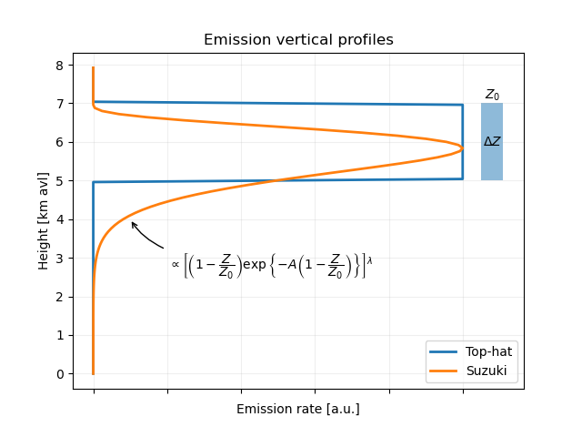
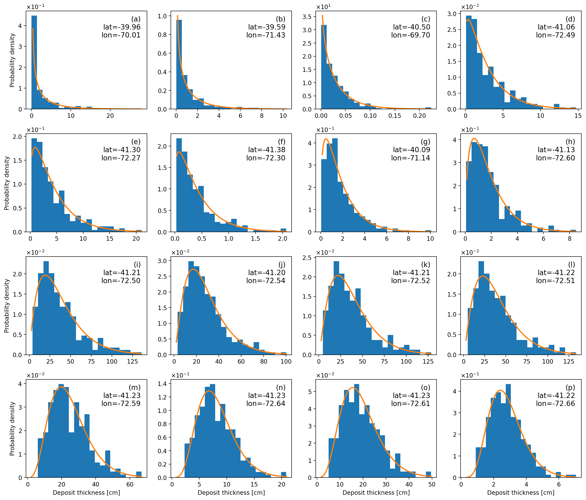
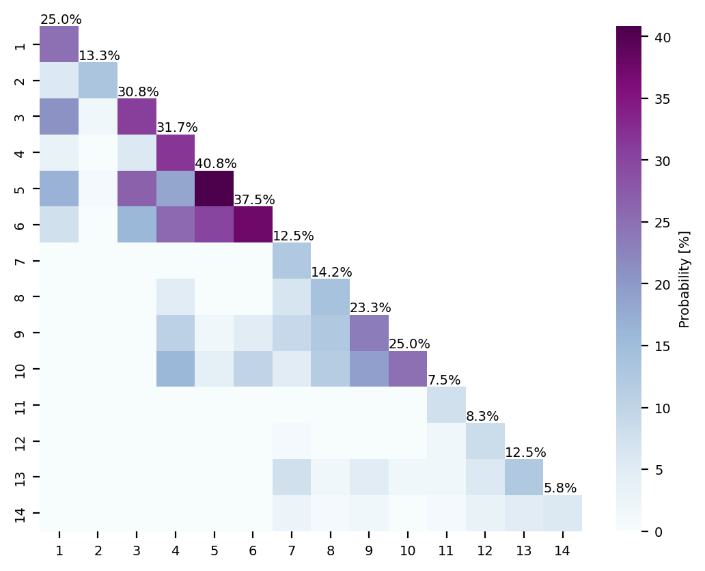
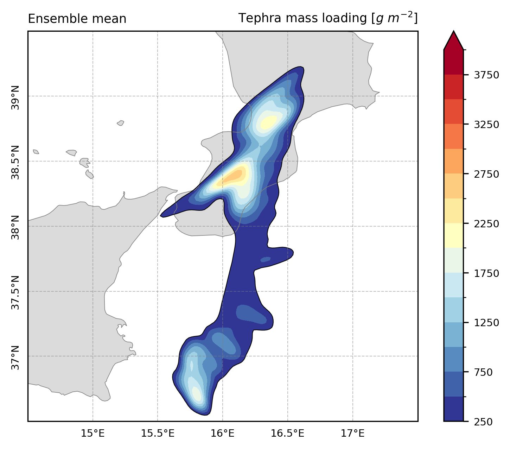
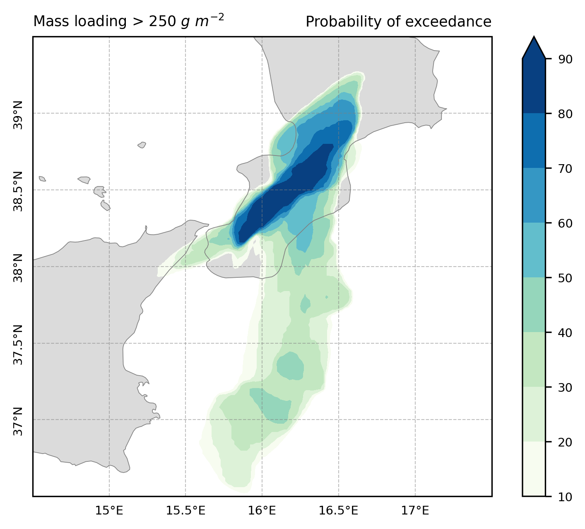
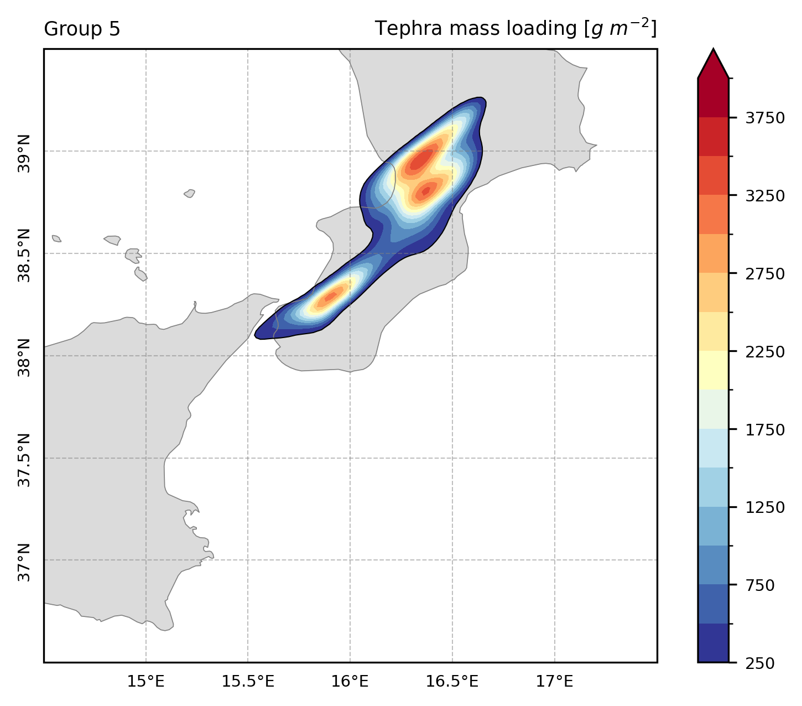
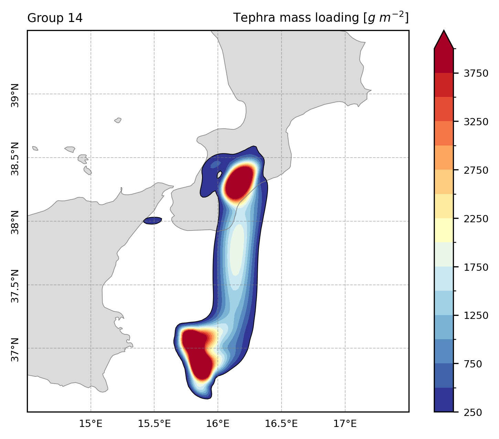
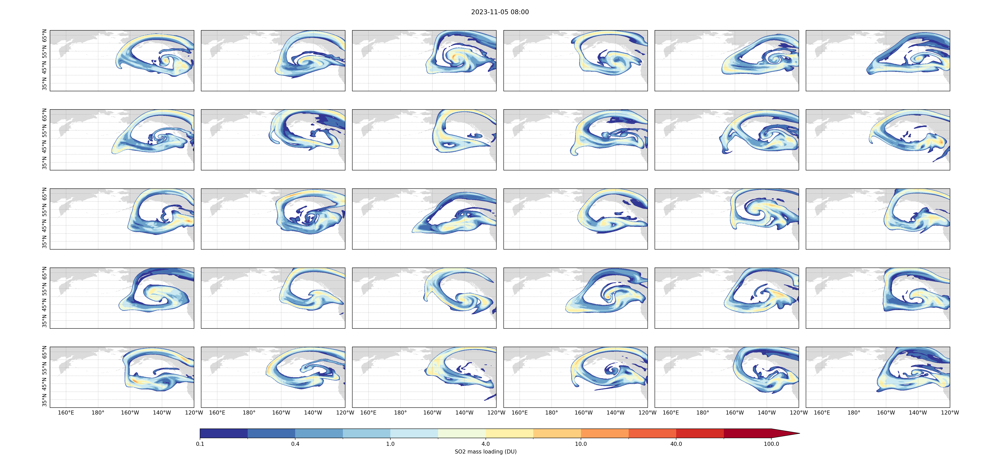
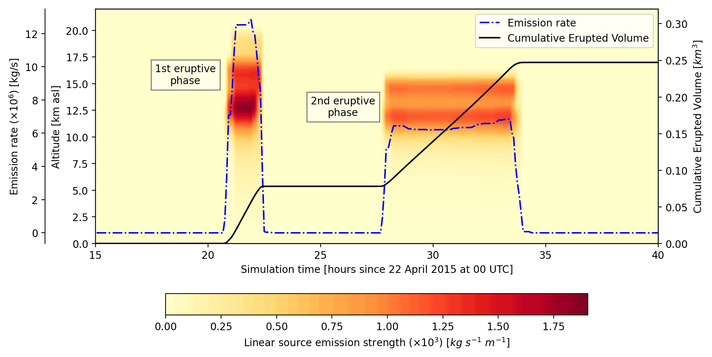

# Introduction and motivation

- Customarily, operational forecast systems rely on volcanic ash transport and dispersal (VATD) models to produce deterministic forecasts
- We can generate realistic representations of the spatio-temporal distribution of airborne volcanic species (i.e. ash and gases) and tephra deposits using a physics-based approach
- In parallel, there has been a growing interest in ensemble approaches for modelling the atmospheric transport of volcanic aerosol and tephra in recent years
- This study explores different challenges involving ensemble modelling and proposes some approaches for dealing with ensemble data 

__Why ensemble modelling?__

- **Uncertainty in model input parameters:** Deterministic models are highly sensitive to uncertain model input parameters (e.g. eruption source parameters) and meteorological fields. We can take into account these uncertainties using ensemble modelling
- **Quantification of model output uncertainty:** Ensemble-based modelling allows one to characterise and quantify model output uncertainties. In addition to traditional forecasting products, the associated errors can be provided 
- **Improvement of forecast skill:** Real observations can be incorporated into dispersal models using ensemble-based data assimilation techniques
- **Source inversion:** Different techniques for source term inversion have been proposed based on ensemble modelling

# Ensemble simulations

:::::::::::::: {.columns}
::: {.column width="35%"}

__Numerical model__:

- FALL3D: model for atmospheric transport and deposition of particles and aerosols

\vspace{1em}

__Ensemble construction__:

- Emission source parameters 
- Grain size distribution
- Aggregation parameters
- Meteorological fields
- Diffusivity coefficients

\vspace{1em}

__Outputs__:

- Ash/gases concentration
- Column mass loading
- Top cloud height
- Deposit mass loading

:::
::: {.column width="65%"}

:::
::::::::::::::

# Ensemble simulations: Probability distribution

:::::::::::::: {.columns}
::: {.column width="35%"}
The gamma distribution provides a good approximation to the ensemble distribution:

- $\overline{y} < \sigma_y$  $\rightarrow$ mode=0
- $\overline{y} > \sigma_y$  $\rightarrow$ mode>0
- Right-skewed probability distributions

\vspace{2em}

:::
::: {.column width="65%"}

:::
::::::::::::::

# Ensemble data complexity reduction

:::::::::::::: {.columns}
::: {.column width="65%"}

\begin{tikzpicture}[overlay, remember picture]

\node<2> at (current page.west)
    [
    anchor=west,
    xshift=40mm,
    yshift=28mm,
    ] { Probability for $i$-member };

\node<2> at (current page.west)
    [
    anchor=west,
    xshift=40mm,
    yshift=22mm
    ] { $P_{ii} = P(d_i<d_{th}) $ };

\node<3> at (current page.west)
    [
    anchor=west,
    xshift=40mm,
    yshift=28mm,
    ] { Joint probability };

\node<3> at (current page.west)
    [
    anchor=west,
    xshift=40mm,
    yshift=22mm
    ] { $P_{ij} = P(d_i<d_{th},d_j<d_{th}) $ };

\node<4> at (current page.west)
    [
    anchor=west,
    xshift=47mm,
    yshift=22mm
    ]
{
\includegraphics[width=0.4\textwidth]{etna2015/map_g05.png}
};

\node<4> at (current page.west)
    [
    draw,
    line width=2pt,
    red,
    circle,
    scale=3,
    xshift=11.5mm,
    yshift=4mm,
    ] {};

\node<5> at (current page.west)
    [
    anchor=west,
    xshift=47mm,
    yshift=22mm
    ]
{
\includegraphics[width=0.4\textwidth]{etna2015/map_g14.png}
};

\node<5> at (current page.west)
    [
    draw,
    line width=2pt,
    red,
    circle,
    scale=3,
    xshift=26.3mm,
    yshift=-10mm,
    ] {};

\end{tikzpicture}

:::
::: {.column width="35%"}

__Run configuration__:

- Test case:  __2015 Etna eruption__
- Ensemble size = 120 members

\vspace{1em}

__Traditional products__:

- Ensemble mean
- Ensemble spread
- Exceedance probability

\vspace{1em}

__Complexity reduction__:

- Remove redundancy in the ensemble data
- We need to measure the distance $d_{ij}$ between two model states $i$ and $j$
- Ensemble members with similar distances are grouped

    \begin{block}{Reduced ensemble}
        \begin{center}
        Ensemble size reduction:\\
        $120 \rightarrow 14$
        \end{center}
    \end{block}

:::
::::::::::::::

# Comparison of products

:::::::::::::: {.columns}
::: {.column width="32%"}

:::
::: {.column width="20%"}
\begin{center}
\underline{Traditional products} \\[1em]
$\leftarrow$ Ensemble mean \\[1em]
Probability of exceedance $\rightarrow$
\end{center}
:::
::: {.column width="32%"}

:::
::::::::::::::

\vspace{1em}

:::::::::::::: {.columns}
::: {.column width="32%"}

:::
::: {.column width="20%"}
\begin{center}
\underline{Reduced ensemble} \\[1em]
$\leftarrow$ High probability state ($41\%$) \\[1em]
Low probability state ($6\%$) $\rightarrow$
\end{center}
:::
::: {.column width="32%"}

:::
::::::::::::::

# Sensitivity study

- Test case: SO2 cloud of the __2023 Klyuchevskoy eruption__ (Kamchatka Peninsula)
- Multiple __ensemble simulations__ were performed perturbing single model parameters
- __Size of the reduced ensemble__ as a measure of the variable sensitivity
- Ensemble size = 120 members

# Sensitivity study

:::::::::::::: {.columns}
::: {.column width="65%"}

:::
::: {.column width="35%"}
- Minimimum ensemble size required
- Sensitivity

\vspace{1em}

:::
::::::::::::::

# Ensemble-based data assimilation {.t}
__GNC method__:

- We propose a heuristic first-order data assimilation method for lower-bounded (positive) variables
- The Gaussian with non-negative constraints (GNC) method assumes a multi-dimensional Gaussian probability distribution and a linear observation operator 
- A non-negative quadratic programming problem is solved using an iterative approach
- This method leads to better results than other DA techniques, including the classical Ensemble Kalman Filter (EnKF)

\only<1>{
    \vspace{2em}
    \centering
    \includegraphics[width=0.8\textwidth]{other/da.pdf}
    }

:::::::::::::: {.columns}
::: {.column width="40%"}
\centering
\includegraphics<2>[width=\textwidth]{millennium/map.png}
:::
::: {.column width="40%"}
\centering
\includegraphics<2>[width=\textwidth]{millennium/deposit.png}
:::
::: {.column width="20%"}
\only<2>{
    \vspace{2em}
    \begin{footnotesize}
    \underline{Millennium eruption} \\[1em]
    Reconstruction of the tephra fallout deposit of the 946 CE Millennium eruption of Changbaishan volcano assimilating deposit thickness data
    \end{footnotesize}
}
:::
::::::::::::::

# Source term inversion
- A technique for emission source inversion based on the GNC method can be used to estimate the space–time distribution of the source
- Valid for problem with weak non-linearity effects

:::::::::::::: {.columns}
::: {.column width="80%"}

:::
::: {.column width="20%"}

\begin{footnotesize}
\underline{Calbuco eruption} \\[1em]
Time evolution of emission rate profiles for the 2015 Calbuco eruption according to the source term inversion approach based on the GNC method
\end{footnotesize}

:::
::::::::::::::

# Conclusions

* When ensemble simulations should be performed instead of the deterministic simulations?
* How the ensemble should be constructed?
* Which variables should be perturbed?
* What's the minimum ensemble size required to properly represent the system state?
* How interpretate and deal with large volumes of ensemble data?
* Which probabilistic output products are relevant?
* Are the traditional assimilation methods suitable for the atmospheric dispersion of volcanic species?
